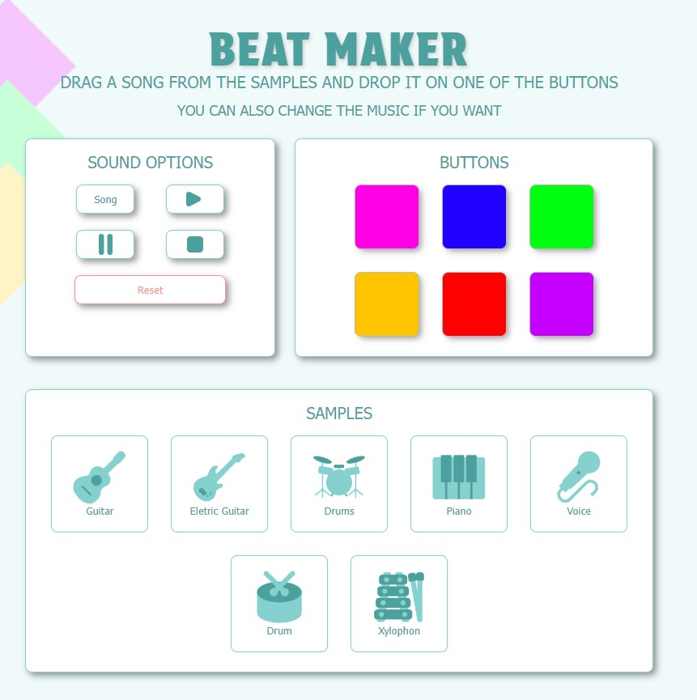
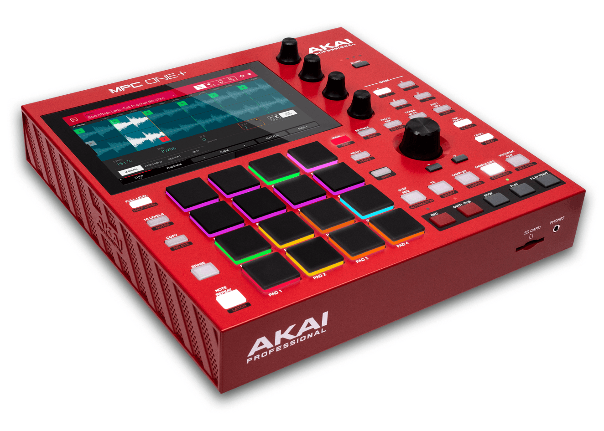
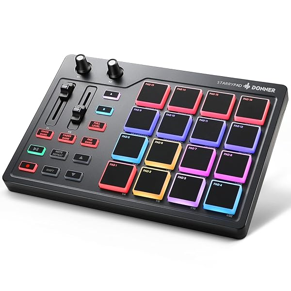

# Nathalia Lima - Music Mixer
This repo is for Multimedia Authoring 2 Project - Music Mixer

___

## About the project

This website is a game, where the user can create their music, with the instruments and audio available. Each instrument must be dragged and dropped at the designated area for the sound to be created.

References / Inspiration:

[Incredibox](https://www.incredibox.com/demo/ "Incredibox")

[Serato](https://serato.com/studio "Serato")

[Lascratcheuse](https://www.lascratcheuse.com/arcylox/transpose "Lascratcheuse")
	

___

## Installation

There is no installation required.

## Usage

Open index.html in the browser of your choice.

## Contributing

1. Fork it!
2. Create your feature branch: `git checkout -b my-new-feature`
3. Commit your changesL `git commit -am 'Add some feature'`
4. Push to the branch: `git push origin my-new-feature`
5. Submit a pull request :D

## History

March 28, 2024

February 08, 2024

## Credits

Nathalia Lima

## License

MIT - please see [license file](LICENSE).
